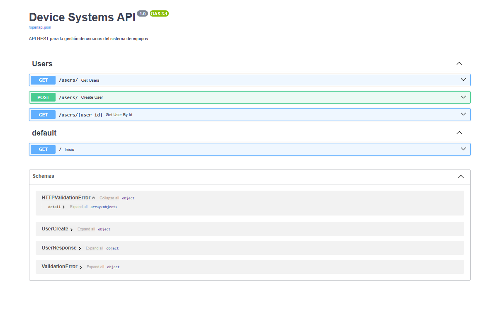
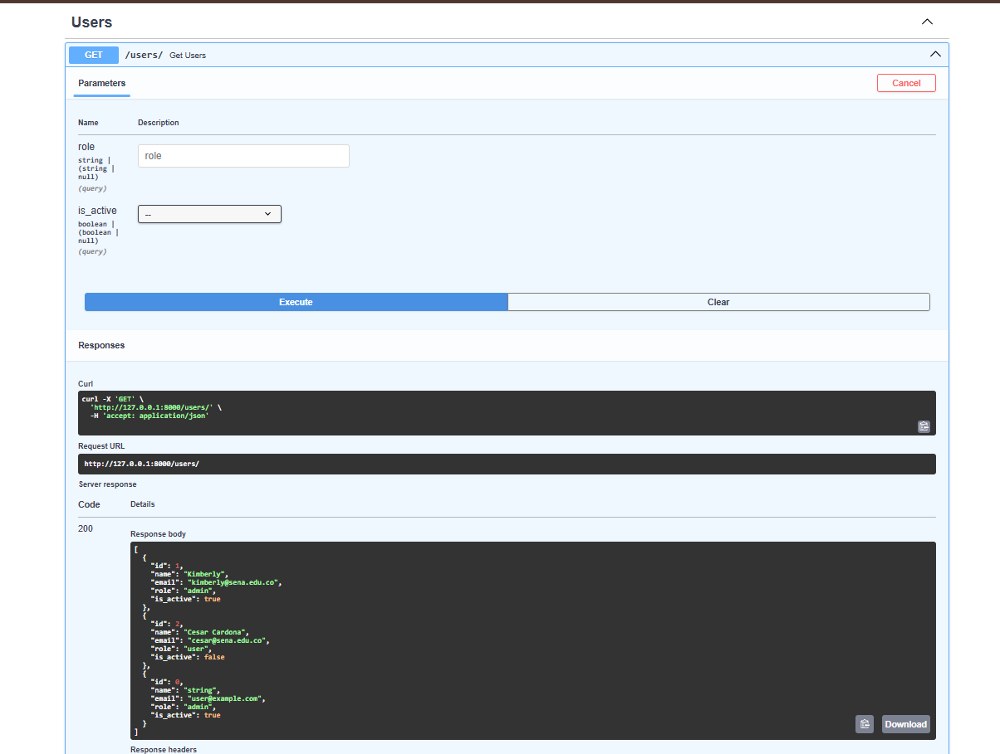
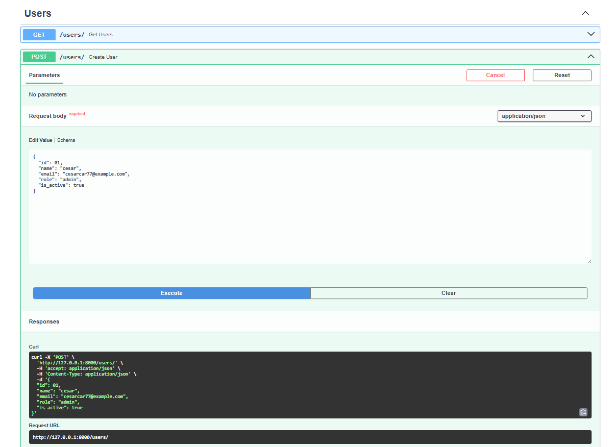
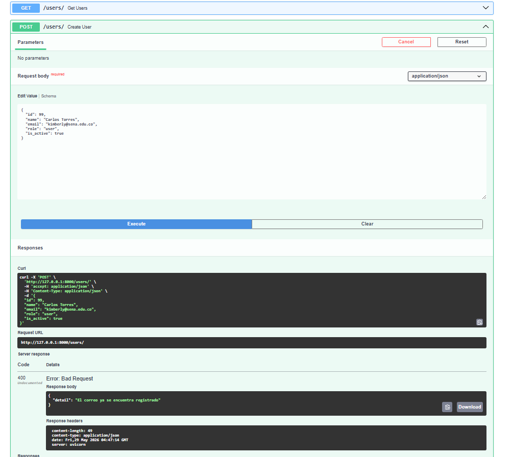
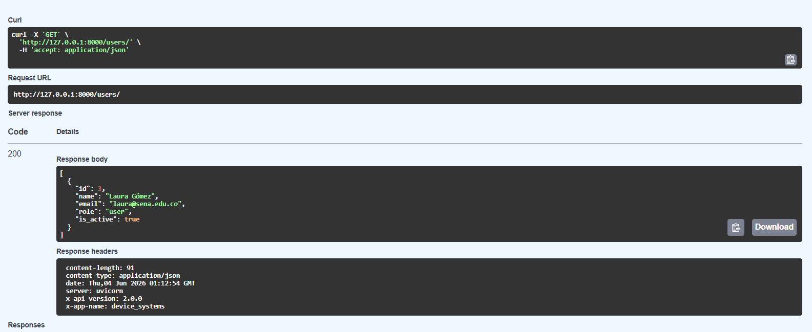
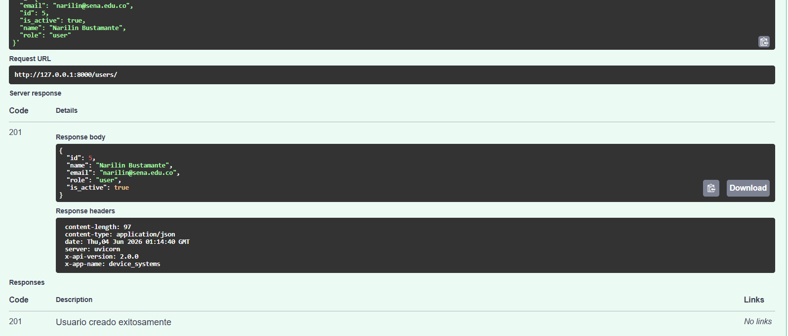
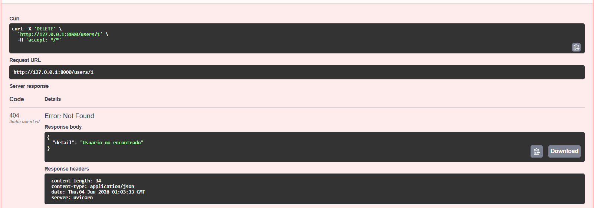
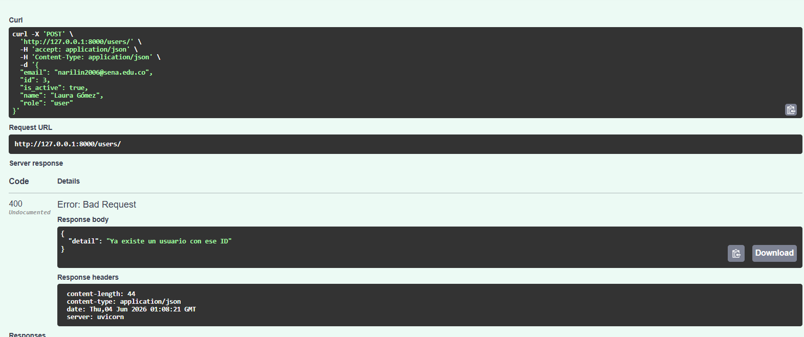
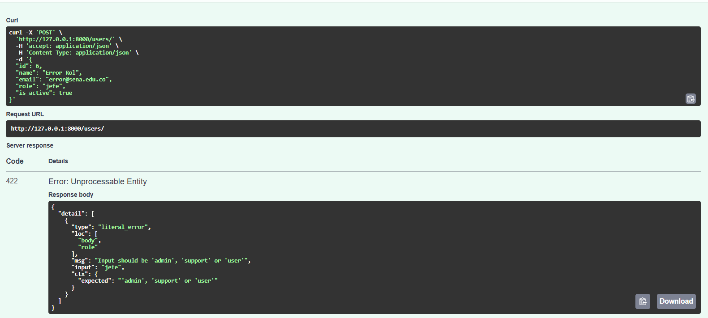
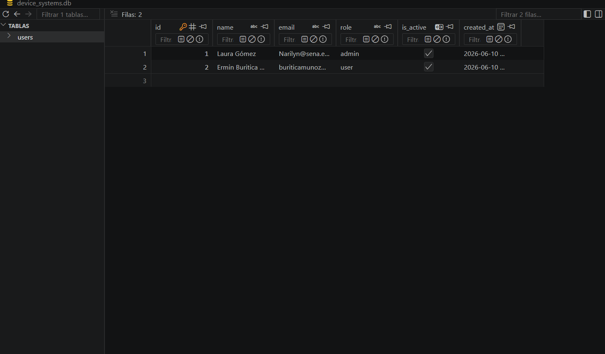

## Evidencias de Pruebas y Funcionamiento (Swagger UI)

A continuación se presentan las capturas de pantalla tomadas desde la documentación interactiva de Swagger UI (`http://127.0.0.1:8000/docs`) que certifican el correcto funcionamiento de la API REST.

### 1. Interfaz Principal de Swagger UI
Muestra la estructura global de los endpoints del recurso `users` y la metadata de la aplicación.



---

### 2. Evidencia de Pruebas: GET /users
Prueba exitosa que retorna la lista de usuarios precargados en la base de datos simulada en memoria, incluyendo las cabeceras HTTP personalizadas `X-App-Name` y `X-API-Version`.



---

### 3. Evidencia de Pruebas: POST /users
Prueba de creación de un nuevo usuario enviando el cuerpo JSON correspondiente y recibiendo la respuesta con el código de estado `201 Created`.



---

### 4. Evidencia de Validaciones y Manejo de Errores
Captura que demuestra el funcionamiento de las restricciones de **Pydantic v2**:
* Intento de registro con un correo electrónico duplicado (Retorna error `400 Bad Request`).
* Validación del campo `role` con valores no permitidos o nombres de longitud menor a 3 caracteres (Retorna error `422 Unprocessable Entity`).



## Codigo 200 
## Codigo 201 
## Codigo 404 
## Codigo 400 
## Codiogo 422 

---

## Instalación

```bash
pip install -r requirements.txt
```

---

## Ejecución

```bash
uvicorn app.main:app --reload
```

Accede a la documentación en:
- Swagger UI: http://127.0.0.1:8000/docs
- ReDoc: http://127.0.0.1:8000/redoc

---

## Endpoints

| Operación           | Método | Ruta             | Código esperado |
|---------------------|--------|------------------|-----------------|
| Listar usuarios     | GET    | /users           | 200 OK          |
| Consultar usuario   | GET    | /users/{user_id} | 200 OK          |
| Crear usuario       | POST   | /users           | 201 Created     |
| Actualizar completo | PUT    | /users/{user_id} | 200 OK          |
| Actualizar parcial  | PATCH  | /users/{user_id} | 200 OK          |
| Eliminar usuario    | DELETE | /users/{user_id} | 204 No Content  |

---

## Códigos de error

| Situación                     | Código |
|-------------------------------|--------|
| Usuario no encontrado         | 404    |
| Correo duplicado              | 400    |
| Rol no permitido              | 400    |
| PATCH sin datos               | 400    |
| Datos inválidos (Pydantic)    | 422    |
| Sin autenticación (X-API-Key) | 401    |

---

## Dependency Injection (`Depends`)

El proyecto usa `Depends()` para reutilizar lógica en múltiples endpoints:

- `get_user_or_404` → busca usuario por ID o lanza 404
- `validar_correo_unico` → verifica que el correo no esté en uso
- `validar_rol_permitido` → verifica que el rol sea válido
- `get_api_config` → retorna configuración general de la API
- `simular_autenticacion` → valida cabecera `X-API-Key`

---

## Roles permitidos

- `admin`
- `support`
- `user`



## Diferencia entre modelo SQLAlchemy y schema Pydantic

El **modelo SQLAlchemy** define cómo se guarda la información en la base de datos,
mientras que el **schema Pydantic** define qué datos recibe y devuelve la API,
validando que sean correctos antes de procesarlos.

---

## ¿Por qué usar base de datos en lugar de listas?

Con listas, los datos se pierden al reiniciar el servidor.
Con SQLite los datos se guardan en el archivo `device_systems.db`
y persisten aunque el servidor se apague.